# 100 days of swiftui

# Projects

| Name          | Image 1                            | Image 2                            | Description                        |
| ------------- | ---------------------------------- | ---------------------------------- | ---------------------------------- |
| Project 1 - WeSplit      | 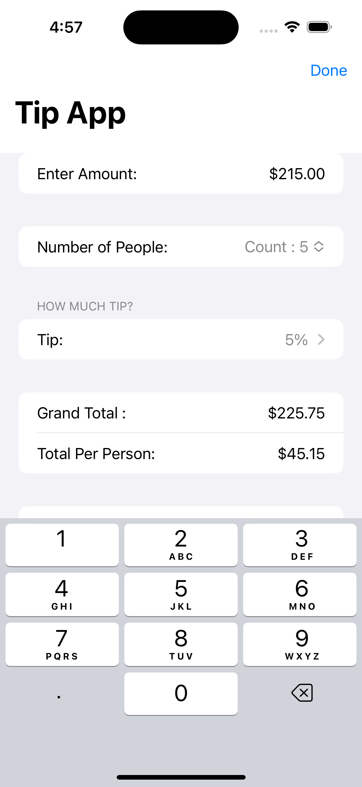     | 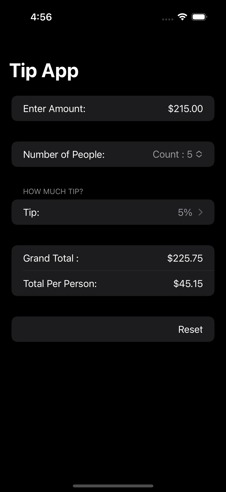 | - A check splitting app. Covered: Form, Section, Picker/PickerStyle, @State, @FocusState, TextField, Two-way binding|
| Challenge 1 - UnitConversion     | 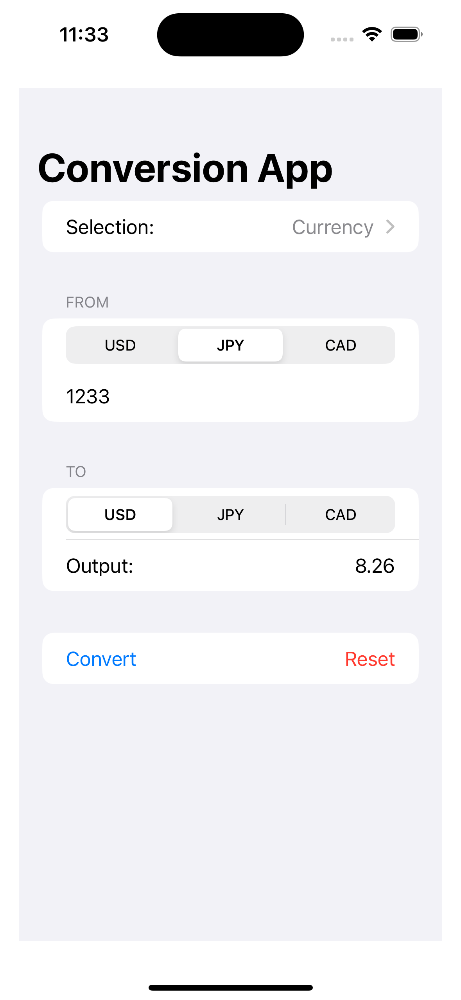     |  | - A unit conversion app. Covered: Form, Section, Picker/PickerStyle, @State, @FocusState, TextField, Two-way binding, Dynamic Picker with Enums, Dictionaries, Optionals|
| Project 2 - Guess The Flag    | 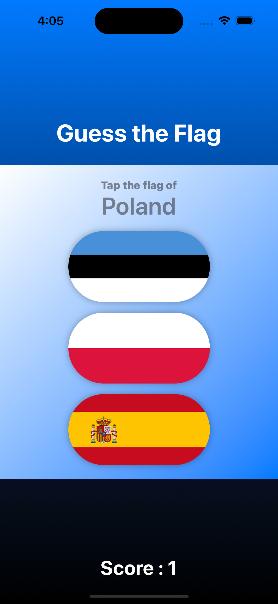     | 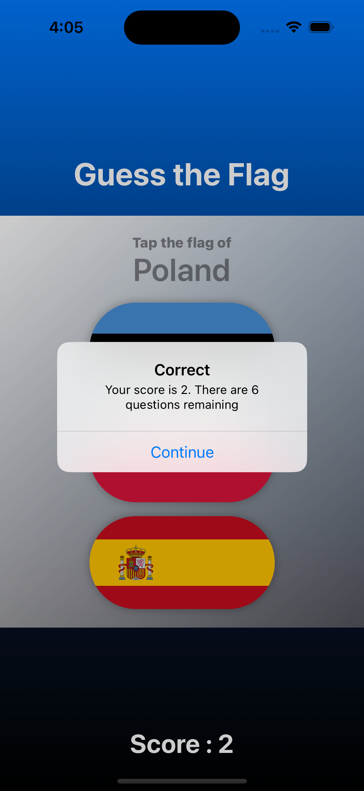 | - A simple guess the flag game. Covered : Assets, Images, accessing Images in Assets, Views, Gradients, Alerts|
| Challenge 2 - Rock Paper Scissors    | 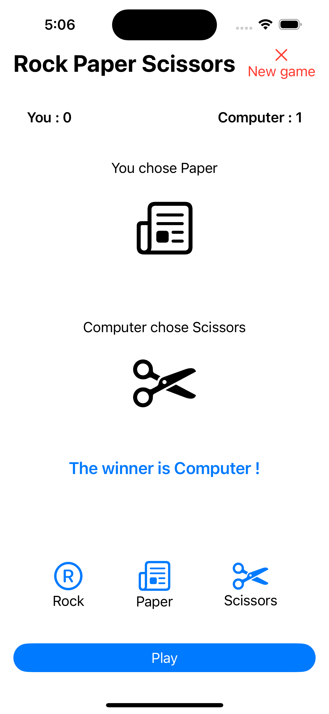     | 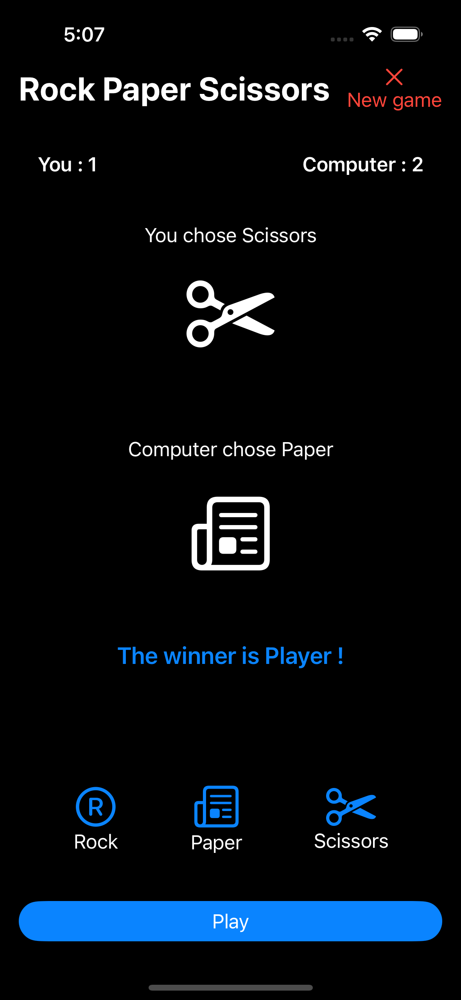 | - Rock paper scissors. Covered : system fonts, Navigation/ToolbarItem, Views as computed properties, custom modifiers (via custom structs and extensions)|
| Project 3 - Better Sleep    | 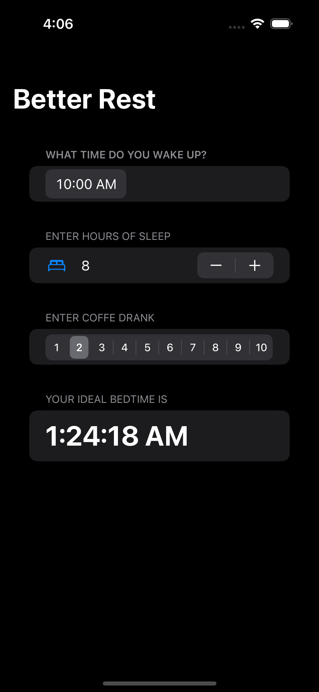     | 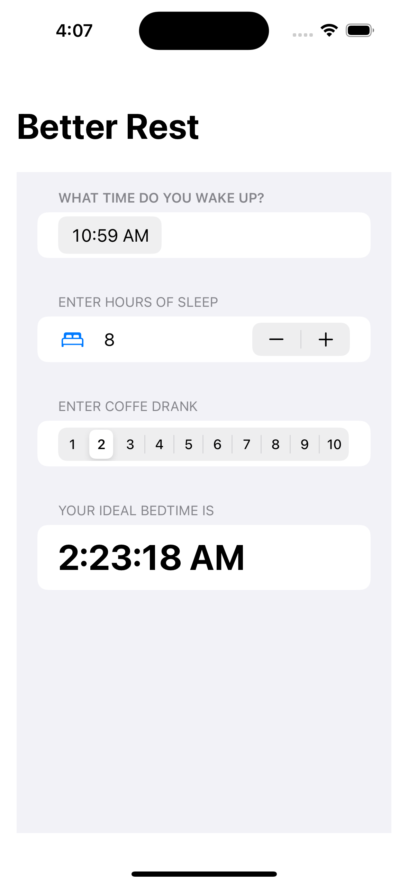 | - A sleeping app built with CoreML. Covered : Date, Date Components, Formatter, Picker
| Project 3 - Word Game    | 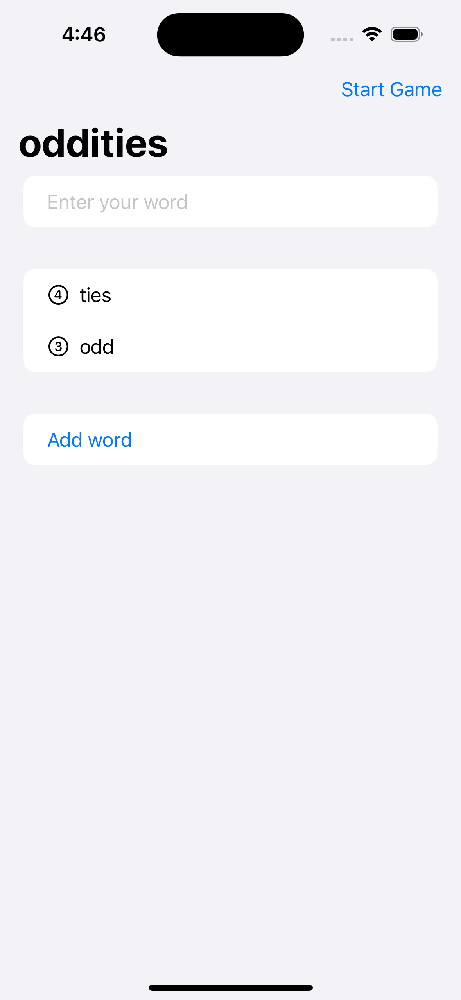     | 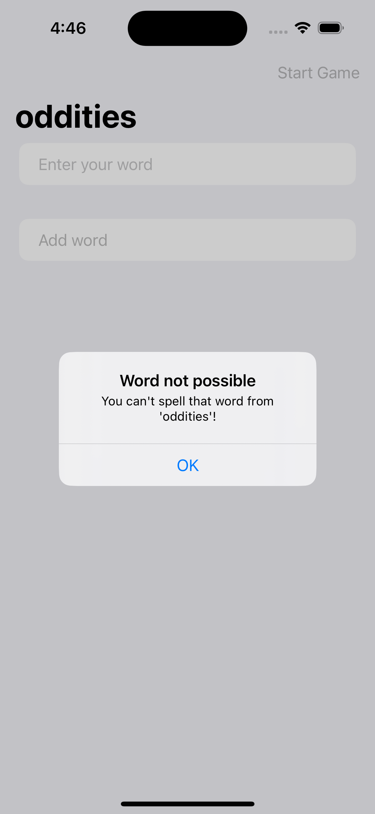 | - A word game. Covered : Bundle loading, Lists, Arrays

