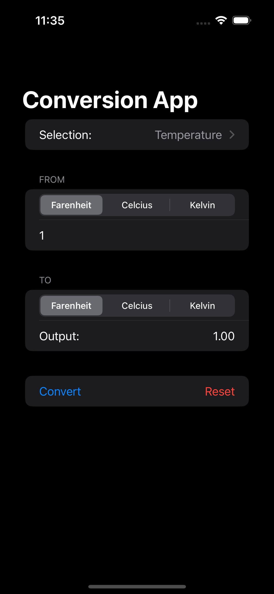

# 100 days of swiftui

# Projects

| Name          | Image 1                            | Image 2                            | Description                        |
| ------------- | ---------------------------------- | ---------------------------------- | ---------------------------------- |
| Project 1 - WeSplit      |      |  | - A check splitting app. Covered: Form, Section, Picker/PickerStyle, @State, @FocusState, TextField, Two-way binding|
| Challenge 1 - UnitConversion     |      |  | - A unit conversion app. Covered: Form, Section, Picker/PickerStyle, @State, @FocusState, TextField, Two-way binding, Dynamic Picker with Enums, Dictionaries, Optionals|

